# Nand ve Nor kapıları

Kaynak
- http://depo.osmaniye.edu.tr/dosyalar/eemb/Dosyalar/Deney%201%285%29.pdf
- https://docplayer.biz.tr/137567-Lojik-ifadenin-ve-degil-veya-veya-degil-lojik-diyagramlarina-donusturulmesi.html
- http://namikakcay.com/wp-content/uploads/2016/05/E2-7.pdf
- https://oguzhancakmak.com.tr/sayisal-tasarim-2-deney-hazirlik-cevaplari/

Sayısal tasarımcılar tasarladıkları devrelerde çoğu zaman NAND ya da NOR kapılarını, AND ya da OR kapılarından daha fazla kullanırlar. Bunun nedenleri NAND, NOR kapılarının 
üretiminin daha kolay olması ve bütün sayısal mantık ailelerinde kullanılan temel kapılar olmasıdır. AND, OR ve NOT kapıları ile verilen Boolean fonksiyonlarını eşdeğer NAND ve
NOR mantık şemalarına dönüştürmek gerekir.
## Nand Kapısı
- NAND kapısı bir AND geçidi ve NOT geçidi birleşimidir. 
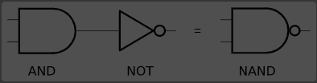
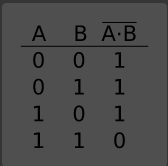

  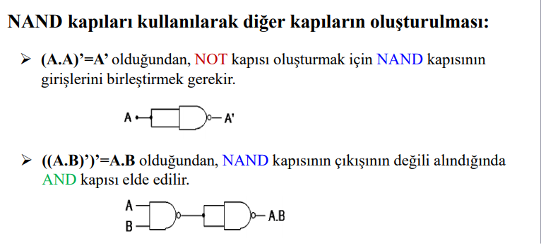 

  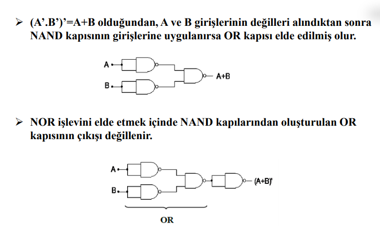 

-   Bir devreyi NAND kapıları ile kurmak istiyorsak fonksiyonu “Çarpımların Toplamı” şeklinde yazmamız gerekir ve devreyi gerçekleştirirken tüm AND kapılarını çıkışlarına ve OR
kapılarının girişlerine NOT kapısı koymuş gibi düşünürsek devrenin işlevinde herhangi bir değişiklik olmaz. Ama AND Ve OR kapıları NAND kapısına dönüşmüş olur. 

  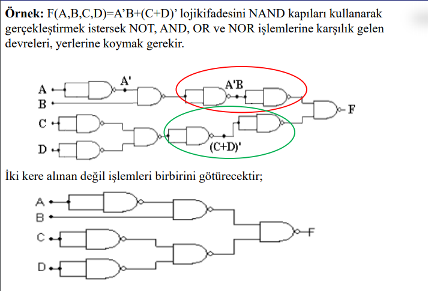 

  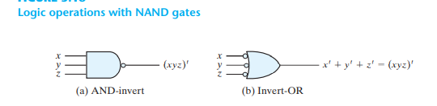 

- Çarpımların toplamı şeklindeki bir ifadenin iki kere değili alınarak nand formuna getiririz.

  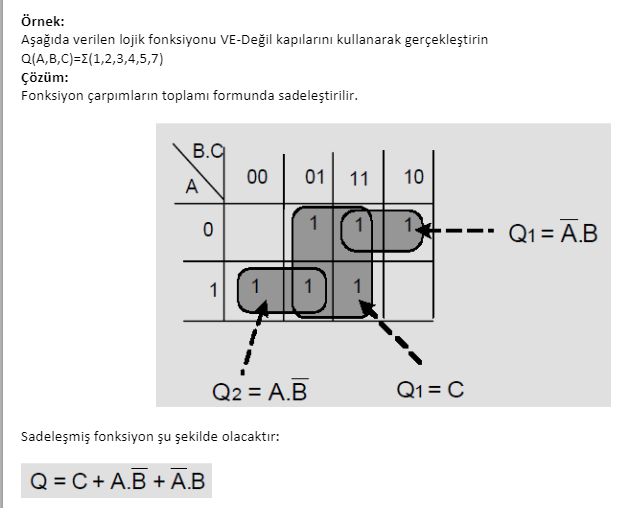 

  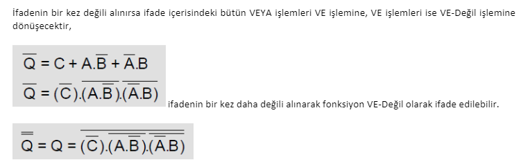 

  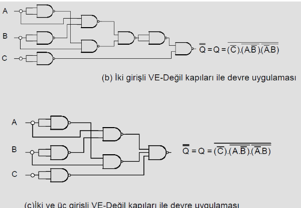 

Sorular :

 F(A,B,C)=Σ(1,3,6,7) şeklinde minimum terimler biçimiyle verilen lojik fonksiyonu sadece iki girişli NAND lojik kapı elemanları kullanarak gerçekleyiniz. 

 1-Lojik fonksiyonun doğruluk tablosunu çiziniz.

  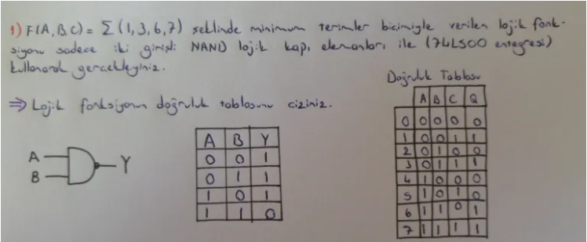 

 2- Verilen lojik fonksiyonu indirgeyiniz. İndirgenmiş fonksiyonu çarpımlar toplamı şeklinde ifade ediniz.

  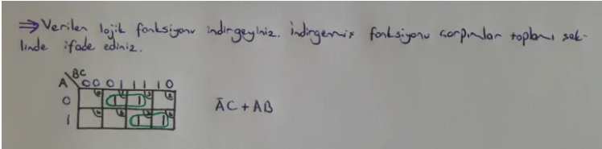 

 3- İndirgenmiş lojik ifadeyi sadece NAND kapıları kullanarak devre tasarımını çiziniz.

  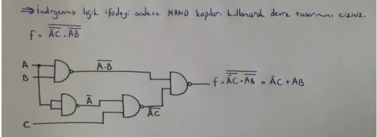 

  

 F(A,B,C,D)=AD + BC'D' + ABC + A'BC'D  şeklinde minimum terimler biçimiyle verilen lojik fonksiyonu sadeleştirip sadece iki girişli NAND lojik kapı elemanları kullanarak gerçekleyiniz. 

  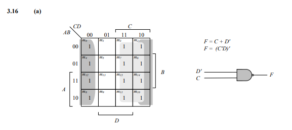 

  

 F(A,B,C,D) = A'B'C'D + CD'+ AC'D şeklinde minimum terimler biçimiyle verilen lojik fonksiyonu sadeleştirip sadece iki girişli NAND lojik kapı elemanları kullanarak gerçekleyiniz. 

  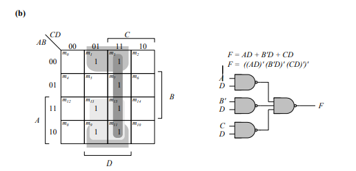 

  

 F(A,B,C,D) =  (A'+C'+D')(A'+C')(C'+D') şeklinde maximum terimler biçimiyle verilen lojik fonksiyonu sadeleştirip sadece iki girişli NAND lojik kapı elemanları kullanarak gerçekleyiniz. 

  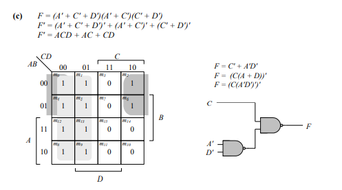 

  

 F(A,B,C,D) = A' + AB + B'C + ACD şeklinde minimum terimler biçimiyle verilen lojik fonksiyonu sadeleştirip sadece iki girişli NAND lojik kapı elemanları kullanarak gerçekleyiniz. 

  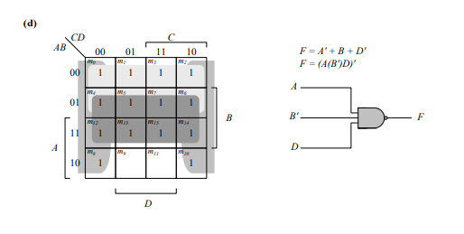 

  

## Nor Kapıları
- Nor kapısı bir or ve not kapısının birleşimidir. 
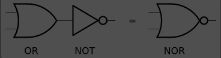
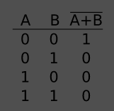

  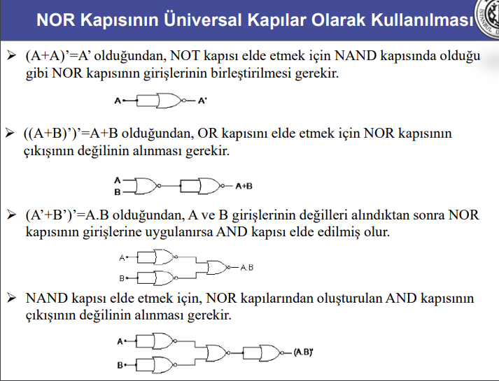 

- Bir devreyi NOR kapıları ile kurmak istiyorsak fonksiyonu “Toplamların Çarpımı” şeklinde yazmamız gerekir ve devreyi gerçekleştirirken tüm OR kapılarını çıkışlarına ve AND
kapılarının girişlerine NOT kapısı Koymuş gibi düşünürsek devrenin işlevinde herhangi bir değişiklik olmaz. Ama AND ve OR kapıları NOR kapısına dönüşmüş olur.

  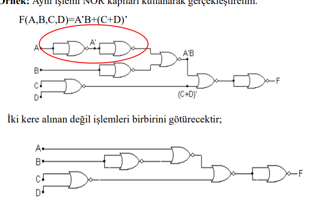 

### Digital design soruları
- Aşağıdaki ifadeleri sadeleştiriniz ve iki girişli Nor kapısıyla uygulayınız.

 

 F(w,x,y,z) = wx'y + xy'z' + w'yz' + xy  

  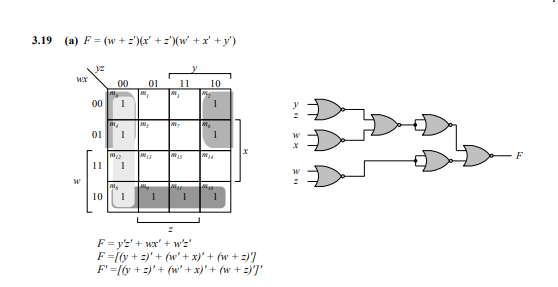 

  

 

 F(w,x,y,z) = ∑(4,7,11,12,15) 

   

  

 

 F(w,x,y,z) = [(x+y)(x+z)]' 

   

  
